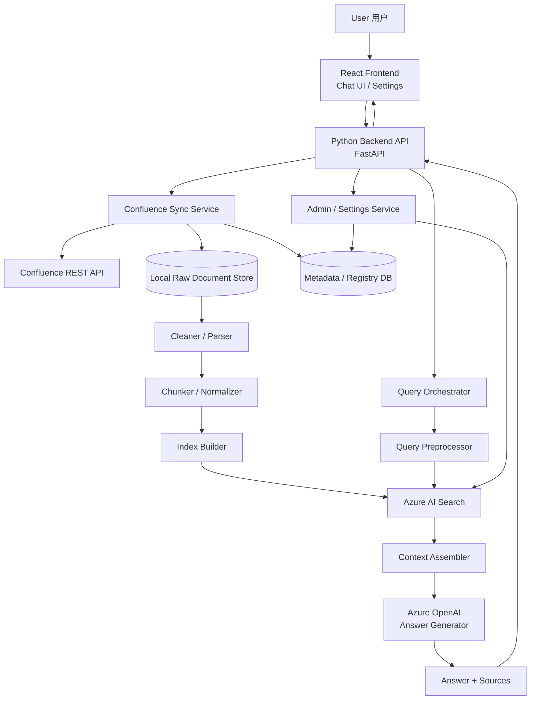

# KMS Bot 智能问答系统详细架构设计文档

## 1. 文档目标

本文档定义一套面向 KMS Bot 的智能问答系统技术架构。系统目标是从 Confluence 空间中同步知识文档到本地，由后端完成清洗、切块、索引与检索，并借助 Azure AI Search 与 Azure OpenAI 提供类 ChatGPT 的问答体验。

该系统面向第一版（V1）设计，重点关注以下目标：

- 提供一个独立于 Confluence UI 的问答入口
- 保证知识来源可控、可追溯、可调试
- 支持主动同步 KMS 文档
- 支持基于检索结果生成带引用来源的答案
- 为后续引入更多模型能力或权限控制预留扩展空间

---

## 2. 总体设计原则

1. **Confluence 是唯一权威知识源**  
   本系统不直接维护业务知识内容，只同步和处理 Confluence 页面。

2. **检索与生成分离**  
   Azure AI Search 负责检索，Azure OpenAI 负责答案生成，Python Server 负责整体编排。

3. **前端只负责交互，不承担知识逻辑**  
   React 前端只做 Chat UI 与 Settings，不直接访问 Azure，也不直接访问 Confluence。

4. **系统必须可调试**  
   每次回答必须能追溯到来源 chunk、来源页面、检索得分和生成上下文。

5. **第一版优先可控和稳定，不优先复杂智能**  
   第一版不做复杂 Agent，不做自动权限裁剪，不做多跳推理链。

---

## 3. 目标系统概览

### 3.1 总体架构说明

系统由五个核心部分组成：

1. **React Frontend**：提供 Chat UI 与 Settings
2. **Python Backend**：负责同步、清洗、切块、检索编排、答案生成
3. **Confluence**：知识源头
4. **Azure AI Search**：chunk 索引与检索
5. **Azure OpenAI**：基于上下文生成最终答案

### 3.2 Mermaid 架构图



### 3.3 纯文本流程图

```text
User
  ↓
React Frontend
  - Chat UI
  - Settings

  ↓
Python Backend API
  - Query API
  - Sync API
  - Admin API

  ├─ Confluence Sync Service
  │    └─ 调用 Confluence REST API
  │         └─ 下载页面正文、元数据、更新时间
  │
  ├─ Local Raw Document Store
  │    └─ 保存原始 XHTML / 文档内容
  │
  ├─ Metadata / Registry DB
  │    └─ 保存 pageId / version / hash / status / index 状态
  │
  ├─ Cleaner / Parser
  │    └─ 清洗 HTML / XHTML，提取正文、标题、列表、表格
  │
  ├─ Chunker / Normalizer
  │    └─ 文档切块，生成统一结构化 chunk
  │
  ├─ Azure AI Search
  │    └─ 存储 chunk 并提供检索
  │
  ├─ Query Preprocessor
  │    └─ 处理用户问题，做 query rewrite / normalize
  │
  ├─ Context Assembler
  │    └─ 将 Top-K chunks 组装成模型上下文
  │
  └─ Azure OpenAI
       └─ 基于上下文生成最终答案

最终返回：
- Answer
- Sources / 引用页面
- 可选相关文档列表
```

---

## 4. 组件分层设计

## 4.1 Frontend Layer（React）

### 职责

前端只负责用户交互，不能承担检索逻辑和模型调用逻辑。

### 页面设计

#### 1）Chat UI（主界面）
用于提供问答能力，形态类似 ChatGPT。

建议功能：
- 问题输入框
- 回答展示区
- 引用来源区
- 历史对话记录
- 相关文档展开面板
- 错误提示与加载状态

#### 2）Settings（配置页）
用于管理员或高级用户执行维护动作。

建议功能：
- 手动触发全量同步
- 手动触发增量同步
- 手动重建索引
- 查看同步状态
- 查看索引状态
- 查看模型配置
- 开关调试模式

### 推荐技术栈

- React
- TypeScript
- Ant Design 或 MUI
- React Query / Zustand

### 前端不应该做的事情

- 不直接访问 Confluence API
- 不直接访问 Azure AI Search
- 不直接访问 Azure OpenAI
- 不自己决定最终回答内容

---

## 4.2 Backend Layer（Python）

### 职责

Python Backend 是系统的核心控制层，负责：

- 提供前端 API
- 同步 Confluence 内容
- 清洗和切块
- 管理 Azure AI Search 索引
- 处理查询流程
- 组装上下文
- 调用 Azure OpenAI
- 返回答案和引用来源

### 推荐技术栈

- Python 3.11+
- FastAPI
- Pydantic
- Uvicorn
- SQLAlchemy（可选）
- httpx / requests

### 推荐 API

```text
POST /api/sync/full
POST /api/sync/incremental
GET  /api/sync/status
POST /api/index/rebuild
GET  /api/index/status
POST /api/query
GET  /api/doc/{page_id}
GET  /api/health
```

---

## 4.3 Knowledge Source Layer（Confluence）

### 职责

Confluence 是系统唯一的知识源。系统从指定空间（如 MCGKM）同步页面内容。

### 同步内容建议

- pageId
- title
- body.storage
- url
- version
- lastUpdated
- labels
- parentId（可选）

### 同步方式

#### 全量同步
用于首次构建本地知识库。

#### 增量同步
用于后续只同步发生变化的页面。

判断依据：
- version 变化
- lastUpdated 变化
- 原始内容 hash 变化

### 推荐实现方式

通过 Confluence REST API：

```text
GET /rest/api/content?spaceKey=MCGKM&type=page
GET /rest/api/content/{id}?expand=body.storage,version,history.lastUpdated,_links
```

---

## 4.4 Raw Storage Layer（本地原始文档层）

### 职责

将同步下来的原始内容落地，以便清洗、排障和回放。

### 推荐保存内容

- 原始 HTML / XHTML
- 页面 metadata JSON
- 清洗后的文本
- 切块后的 chunk JSON

### 推荐目录结构

```text
data/
├─ raw/
├─ meta/
├─ cleaned/
├─ chunks/
├─ logs/
└─ export/
```

### 原因

- 保留原始数据有助于排查清洗和切块错误
- 后续可以无须重新请求 Confluence 即重建索引
- 便于增量更新和故障恢复

---

## 4.5 Registry / Metadata Layer（状态管理层）

### 职责

保存每个页面的处理状态，用于：

- 增量判断
- 重试控制
- 幂等更新
- 索引状态跟踪
- 失败排查

### 推荐实现

V1 使用 SQLite 即可。

### 建议字段

```text
page_id
title
source_version
last_updated
raw_hash
clean_hash
chunk_count
index_status
last_sync_time
last_index_time
error_message
```

### 后续可扩展字段

```text
access_scope
owner
topic_group
summary_status
embedding_version
```

---

## 4.6 Cleaner / Parser Layer（清洗解析层）

### 职责

将 Confluence 页面中的 XHTML / HTML 转换成适合切块和检索的文本结构。

### 处理内容

- 去掉脚本、样式、无效标签
- 提取标题结构（h1/h2/h3）
- 提取正文段落
- 提取列表
- 提取表格文本
- 去掉重复模板和低价值噪音

### 推荐技术

- BeautifulSoup
- lxml
- 正则规则

### 输出示例

```json
{
  "doc_id": "12345",
  "title": "How to reset iPension access",
  "sections": [
    {
      "heading": "Overview",
      "content": "..."
    },
    {
      "heading": "Steps",
      "content": "..."
    }
  ],
  "plain_text": "..."
}
```

---

## 4.7 Chunker / Normalizer Layer（切块层）

### 职责

把清洗后的文档切成适合 Azure AI Search 检索的最小知识单元。

### 为什么必须切块

如果直接以整页作为检索单位，会出现：

- 召回不准确
- 上下文过长
- 模型成本升高
- 引用来源不细致

### 推荐切块策略

#### 优先规则
1. 按标题小节切块
2. 长段落按长度再切块
3. 表格内容按逻辑块整理
4. 每个 chunk 尽量保持主题单一

### 推荐 chunk 结构

```json
{
  "chunk_id": "12345#steps#1",
  "doc_id": "12345",
  "title": "How to reset iPension access",
  "section": "Steps",
  "content": "Step 1 ... Step 2 ...",
  "url": "...",
  "tags": ["ipension", "access", "reset"]
}
```

### 建议控制项

- 单 chunk 长度控制
- 保留来源链接
- 为 title / section / tags 提供额外检索权重

---

## 4.8 Azure AI Search Layer（检索层）

### 职责

Azure AI Search 负责存储 chunk 并执行查询。

### V1 中它只做两件事

1. 存储标准化后的 chunks
2. 根据 query 返回最相关的 Top-K chunks

### 不做的事情

- 不负责原始文档同步
- 不直接向用户生成答案
- 不自动接管整个问答链路

### 推荐索引字段

```text
chunk_id      (key)
doc_id
title
section
content
tags
url
last_updated
```

### V1 检索策略建议

第一版建议使用：

- keyword search
- BM25
- hybrid search（可选）

不建议第一版就把重点放在复杂向量搜索上，因为第一版更重要的是：

- 检索可解释
- 调优简单
- 易于排查

---

## 4.9 Query Preprocessor Layer（查询预处理层）

### 职责

在真正检索之前，对用户问题进行规范化处理，以提高召回率。

### 可做内容

- 去停用词
- 大小写统一
- 术语标准化
- 同义词扩展
- 可选 query rewrite

### 示例

用户输入：

```text
How can I fix iPension login issue?
```

检索 query 可被处理为：

```text
ipension login access reset authentication issue
```

### 设计原则

第一版保持简单，以规则化预处理为主；不要一开始引入复杂 NLP 流程。

---

## 4.10 Context Assembler Layer（上下文组装层）

### 职责

将 Azure AI Search 返回的 Top-K chunks 变成可输入到 Azure OpenAI 的上下文。

### 为什么这一层很关键

检索结果不等于模型输入。系统必须：

- 去重
- 限长
- 排序
- 保留来源
- 保证上下文信息密度

### 推荐组装逻辑

- 选 Top 5～8 chunks
- 去掉高度重复内容
- 每个 chunk 限制最大长度
- 保留标题、section 和 url
- 按 score 排序

### 模型输入示例

```text
[Source 1]
Title: ...
Section: ...
Content: ...

[Source 2]
Title: ...
Section: ...
Content: ...
```

---

## 4.11 Azure OpenAI Layer（答案生成层）

### 职责

Azure OpenAI 只负责基于系统提供的上下文生成最终答案。

### 正确定位

Azure OpenAI 在本系统中是 **Answer Generator**，不是检索器。

### 模型应该做的事

- 组织答案
- 总结步骤
- 将 chunk 信息变成自然语言
- 生成结构化回答

### 模型不应该做的事

- 跳过检索直接回答
- 使用外部知识补全未知内容
- 自由发挥未检索到的信息

### Prompt 原则

建议固定系统提示：

```text
You must answer strictly based on the provided context.
Do not use outside knowledge.
If the answer is not found, say "Not found in the knowledge base".
Always cite the source title or source URL.
```

---

## 5. 端到端流程设计

## 5.1 同步流程（Sync Flow）

```text
管理员在 Settings 页面点击“同步 KMS”
    ↓
Frontend 调用 /api/sync/full 或 /api/sync/incremental
    ↓
Backend 调用 Confluence REST API
    ↓
下载页面正文和 metadata
    ↓
保存原始文档到 Local Raw Store
    ↓
调用 Cleaner / Parser 清洗内容
    ↓
调用 Chunker 生成 chunk
    ↓
写入 / 更新 Azure AI Search 索引
    ↓
更新 Registry DB
    ↓
返回同步结果
```

## 5.2 问答流程（Query Flow）

```text
用户在 Chat UI 输入问题
    ↓
Frontend 调用 /api/query
    ↓
Backend 执行 Query Preprocessor
    ↓
调用 Azure AI Search 获取 Top-K chunks
    ↓
Context Assembler 组装模型上下文
    ↓
调用 Azure OpenAI 生成答案
    ↓
返回：
- answer
- sources
- related documents
```

---

## 6. API 设计建议

## 6.1 Query API

### 请求

```json
{
  "question": "How to reset iPension access?",
  "top_k": 5,
  "debug": false
}
```

### 响应

```json
{
  "answer": "...",
  "sources": [
    {
      "title": "How to reset iPension access",
      "url": "...",
      "section": "Steps"
    }
  ],
  "related_documents": [
    {
      "page_id": "12345",
      "title": "...",
      "url": "..."
    }
  ]
}
```

## 6.2 Sync API

### 全量同步

```text
POST /api/sync/full
```

### 增量同步

```text
POST /api/sync/incremental
```

### 状态查询

```text
GET /api/sync/status
```

## 6.3 Index API

```text
POST /api/index/rebuild
GET  /api/index/status
```

---

## 7. 数据存储设计

## 7.1 文件存储

建议保存：

- raw HTML / XHTML
- metadata JSON
- cleaned JSON
- chunks JSON
- logs

## 7.2 SQLite / PostgreSQL

### V1 推荐
- SQLite

### 后续扩展
- PostgreSQL

### 存储对象建议
- 页面主数据
- 处理状态
- 错误日志
- 同步批次
- 索引写入记录

---

## 8. 推荐技术栈

### 前端
- React
- TypeScript
- Ant Design / MUI
- React Query / Zustand

### 后端
- Python 3.11+
- FastAPI
- Pydantic
- Uvicorn
- httpx

### 文档处理
- BeautifulSoup
- lxml
- regex

### 存储
- 文件系统
- SQLite（V1）
- PostgreSQL（可升级）

### Azure
- Azure AI Search
- Azure OpenAI

### 部署
- Docker（建议）
- Linux / Windows Server
- Nginx（可选）

---

## 9. 安全设计建议

1. **前端绝不保存 Azure Key 或 Confluence Token**
2. 所有 Secret 必须放在：
   - 环境变量
   - Secret Manager
   - Key Vault
3. 后端统一管理对 Azure 和 Confluence 的访问
4. 日志中不能打印 token、密钥和敏感请求头
5. 若已有密钥曾被暴露，应立即轮换

---

## 10. 第一版必须做和不要做的内容

## 10.1 第一版必须做

- Confluence 全量 / 增量同步
- 原始文档落地
- 文档清洗
- chunk 索引
- Azure AI Search 检索
- Azure OpenAI 问答
- Chat UI
- Settings 页面
- 引用来源展示
- 同步 / 索引状态查看

## 10.2 第一版不要做

- 不要让前端直接访问 Azure
- 不要让模型直接访问 Confluence
- 不要跳过 chunk，直接整页送模型
- 不要引入复杂 Agent
- 不要一开始做细粒度权限系统
- 不要把 Copilot 作为黑盒 RAG 主体

---

## 11. 最终结论

V1 架构建议采用：

- **React Frontend**：提供 Chat UI 和 Settings
- **Python Backend**：负责同步、清洗、切块、检索编排和模型调用
- **Confluence**：唯一知识源
- **Azure AI Search**：chunk 存储与检索
- **Azure OpenAI**：基于检索结果生成答案

系统关键原则：

1. 检索权由 Server 控制
2. 模型只基于已检索上下文回答
3. 前端不直接访问 Azure
4. 第一版优先做稳定、可控、可 debug 的问答链路

这套设计适合第一版直接落地，也适合作为后续接入更多模型能力或权限体系的基础。 
