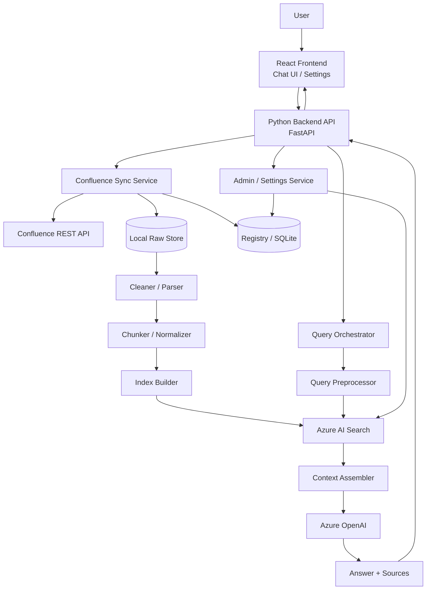

# KMS Bot 智能问答系统架构设计文档（POC / V1）

## 1. 文档目标

本文档定义一套面向 **KMS Bot** 的 POC 级智能问答系统技术架构。
系统目标是从 **Confluence KMS 空间** 同步知识文档到本地，由后端完成清洗、切块、索引与检索，并借助 **Azure AI Search** 与 **Azure OpenAI** 提供类 ChatGPT 的问答体验。

本版本基于以下最新决策：

- KMS 空间是 **跨团队公共知识库**
- V1 / POC **不做权限控制（ACL）**
- 使用 **一个统一的 `pipeline_version`** 管理重处理版本
- **业务策略统一放在 Python Backend**，不放在 Azure Portal 中
- **Prompt 模板放在后端文件中管理**，不放在前端，也不依赖 Azure Portal 手工维护
- 使用一个大的 configuration（逻辑统一），但在结构上分 section 管理
- 不建设独立运维系统，只提供最小 **Admin / Settings / Status** 能力
- 这是 POC，**不建设指标平台**，只保留最小排障能力

---

## 2. 核心假设（Assumptions）

### 2.1 知识空间假设

- Confluence KMS 空间是公共跨团队知识空间
- 页面面向内部协作开放，不存在用户级或页面级访问控制要求
- 因此，V1 明确 **不实现 retrieval-time ACL filtering**

### 2.2 系统范围假设

- 知识源仅来自指定 Confluence KMS Space
- V1 只处理 Confluence 页面内容，不处理复杂权限逻辑
- V1 不引入 Agent Workflow、多跳推理链、复杂流程编排
- V1 不做向量检索、Hybrid 检索、Reranker
- V1 不做指标平台、告警平台、独立运维后台

### 2.3 演进假设

系统代码结构与配置应保留未来扩展能力，但 **POC 不提前实现未来功能**。
只要求：

- 代码结构可扩展
- 配置结构可扩展
- Search / Answer / Parser / Chunker 保留替换空间

---

## 3. 总体设计原则

1. **Confluence 是唯一权威知识源**  
   系统不维护业务知识内容，只同步和处理 Confluence 页面。

2. **检索与生成分离**  
   Azure AI Search 负责检索，Azure OpenAI 负责生成，Python Backend 负责编排。

3. **前端只负责交互**  
   React Frontend 只负责 Chat UI 与 Settings，不承担知识逻辑。

4. **业务策略由 Backend 控制**  
   同步、清洗、切块、检索、上下文组装、Prompt 选择、降级逻辑都由后端控制。

5. **Prompt 由后端文件管理**  
   Prompt 模板放在后端 `prompts/` 目录，而不是放在 Azure Portal 或前端 Settings 中。

6. **POC 优先可控与稳定**  
   第一版优先稳定、可 debug、可维护，不追求复杂智能能力。

7. **统一配置，分 section 管理**  
   使用统一 configuration 文件（如 `config/app.yaml`），按功能分 section。

8. **使用单一 `pipeline_version`**  
   只要清洗、切块、索引结构发生导致需要重建的变化，就更新 `pipeline_version`。

---

## 4. 总体系统架构

### 4.1 核心组件

系统由以下五个核心部分构成：

1. **React Frontend**：Chat UI + Settings / Admin UI
2. **Python Backend**：核心控制层
3. **Confluence**：唯一知识源
4. **Azure AI Search**：Chunk 索引与检索
5. **Azure OpenAI**：基于上下文生成答案

### 4.2 Mermaid 架构图



### 4.3 纯文本流程图

```text
User
 ↓
React Frontend
 - Chat UI
 - Settings / Admin
 ↓
Python Backend API
 - Query API
 - Sync API
 - Index API
 - Status API
 ├─ Confluence Sync Service
 │   └─ 调用 Confluence REST API
 │   └─ 下载页面正文与元数据
 │
 ├─ Local Raw Store
 │   └─ 保存原始 HTML/XHTML
 │
 ├─ Registry DB (SQLite)
 │   └─ 保存 page 状态、hash、chunk_count、pipeline_version、index_status
 │
 ├─ Cleaner / Parser
 │   └─ 清洗 HTML / XHTML，提取结构化正文
 │
 ├─ Chunker / Normalizer
 │   └─ 生成标准化 chunks
 │
 ├─ Azure AI Search
 │   └─ 存储 chunk 并提供 BM25 检索
 │
 ├─ Query Preprocessor
 │   └─ 规则化处理 query
 │
 ├─ Context Assembler
 │   └─ 组装 Top-K chunks 为模型上下文
 │
 └─ Azure OpenAI
     └─ 基于上下文生成最终答案

最终返回：
- answer
- sources
- related_documents
- debug information（可选）
```

---

## 5. 分层设计

## 5.1 Frontend Layer（React）

### 职责

Frontend 只负责：

- Chat UI
- Settings / Admin UI
- 状态展示
- Source 展示
- 错误与加载状态展示

### 不负责

- 不访问 Confluence API
- 不访问 Azure AI Search
- 不访问 Azure OpenAI
- 不自己生成最终回答
- 不保存密钥或 Token

### 页面

#### 1）Chat UI

- 问题输入框
- 回答展示区
- 引用来源区
- 历史对话记录（POC 可本地）
- 相关文档面板
- 可选 Debug Panel

#### 2）Settings / Admin UI

- Full Sync
- Incremental Sync
- Rebuild Index
- 查看 Sync Status
- 查看 Index Status
- 查看 Health Status
- 查看当前配置（只读或有限可改）
- Debug 开关

### 推荐技术栈

- React
- TypeScript
- Ant Design 或 MUI
- React Query / Zustand

---

## 5.2 Backend Layer（Python）

### 职责

Python Backend 是系统核心控制层，负责：

- 提供前端 API
- 同步 Confluence 内容
- 文档清洗
- 文档切块
- 管理 Azure AI Search 索引
- 处理查询流程
- 组装上下文
- 调用 Azure OpenAI
- 返回答案和来源
- 管理运行时配置

### 业务策略统一放在 Backend

以下策略必须由后端控制：

- Sync 策略
- Parser / Cleaner 策略
- Chunk 策略
- Query Preprocess 策略
- Context Assembly 策略
- Prompt 选择策略
- Fallback / Debug 策略

### 推荐技术栈

- Python 3.11+
- FastAPI
- Pydantic
- Uvicorn
- httpx
- SQLAlchemy（可选）

### API 建议

```text
POST /api/sync/full
POST /api/sync/incremental
GET  /api/sync/status
POST /api/index/rebuild
GET  /api/index/status
POST /api/query
GET  /api/health
```

---

## 5.3 Knowledge Source Layer（Confluence）

### 职责

Confluence 是系统唯一知识源。系统从指定公共 KMS Space 同步页面内容。

### 同步内容建议

- `pageId`
- `title`
- `body.storage`
- `url`
- `version`
- `lastUpdated`
- `labels`
- `parentId`（可选）

### 同步方式

#### 全量同步
用于首次构建知识库。

#### 增量同步
用于后续仅同步变化页面。

### 变化判断基础

- source `version`
- `lastUpdated`
- `raw_hash`
- `pipeline_version`

### 推荐接口

```text
GET /rest/api/content?spaceKey=<SPACE>&type=page
GET /rest/api/content/{id}?expand=body.storage,version,history.lastUpdated,_links
```

---

## 5.4 Raw Storage Layer（原始文档层）

### 职责

将同步下来的原始内容落地，便于：

- 排障
- 清洗回放
- 重建索引
- 本地重处理

### 建议保存内容

- 原始 HTML / XHTML
- 页面 metadata JSON
- cleaned JSON
- chunk JSON
- logs

### 推荐目录结构

```text
data/
├─ raw/
├─ meta/
├─ cleaned/
├─ chunks/
├─ logs/
└─ export/
```

---

## 5.5 Registry / Metadata Layer（状态管理层）

### 职责

保存每个页面的处理状态，用于：

- 增量判断
- 幂等更新
- 重试控制
- 索引状态追踪
- 失败排查

### POC 推荐实现

- SQLite

### 建议字段

```text
page_id
title
source_version
last_updated
raw_hash
chunk_count
pipeline_version
index_status
last_sync_time
last_index_time
error_message
```

### 设计说明

POC 只使用一个统一字段：

```text
pipeline_version
```

而不是在 POC 中拆出 parser_version / chunker_version / embedding_version / prompt_version 等多个字段。

---

## 5.6 Cleaner / Parser Layer（清洗解析层）

### 职责

将 Confluence HTML / XHTML 转换为适合切块和检索的结构化文本。

### POC 支持矩阵

#### 支持

- 标题（h1 / h2 / h3）
- 段落文本
- 列表
- 普通表格（转可读文本）
- 基础代码块（按文本保留）

#### 降级支持

- 一些简单提示块 / 展开块

#### 暂不支持

- OCR 图片文字提取
- 复杂宏深度解析
- 附件内容解析（PDF / Word / Excel）
- 复杂嵌套结构的完美还原

### 推荐处理内容

- 去掉脚本、样式、无效标签
- 提取标题层级
- 提取正文段落
- 提取列表
- 提取表格文本
- 去掉重复模板与低价值噪音

### 推荐技术

- BeautifulSoup
- lxml
- regex

### 输出示例

```json
{
  "doc_id": "12345",
  "title": "How to reset iPension access",
  "sections": [
    {"heading": "Overview", "content": "..."},
    {"heading": "Steps", "content": "..."}
  ],
  "plain_text": "..."
}
```

---

## 5.7 Chunker / Normalizer Layer（切块层）

### 职责

将清洗后的文档切分为适合检索的最小知识单元（chunk）。

### 推荐切块策略

1. 优先按标题小节切块
2. 长段落按长度再切块
3. 保持单个 chunk 主题单一
4. 表格按逻辑块整理后纳入 chunk

### 推荐 chunk 结构

```json
{
  "chunk_id": "12345#steps#1",
  "doc_id": "12345",
  "title": "How to reset iPension access",
  "section": "Steps",
  "content": "Step 1 ... Step 2 ...",
  "url": "...",
  "tags": ["ipension", "access", "reset"],
  "pipeline_version": 1
}
```

### 设计控制项

- 控制单 chunk 长度
- 保留来源链接
- 为 `title / section / tags` 提供额外检索价值
- 将 `pipeline_version` 带入 chunk

---

## 5.8 Azure AI Search Layer（检索层）

### 职责

Azure AI Search 负责：

1. 存储标准化后的 chunks
2. 根据 query 返回最相关的 Top-K chunks

### V1 检索范围

POC / V1 只使用：

- Keyword Search
- BM25

### 明确不做

- 向量检索
- Hybrid Search
- Reranker
- Search side orchestration

### 推荐索引字段

```text
chunk_id (key)
doc_id
title
section
content
tags
url
last_updated
pipeline_version
```

### 设计说明

虽然当前不实现向量检索，但代码层面应保留未来替换 SearchProvider 的空间。

---

## 5.9 Query Preprocessor Layer（查询预处理层）

### 职责

在检索前对用户问题进行规则化处理，提高召回率。

### POC 可做内容

- 去停用词（可选）
- 大小写统一
- 基础术语标准化
- 简单同义词扩展（可选）

### 当前不做

- 复杂 NLP Pipeline
- LLM Query Rewrite（默认不启用）

### 示例

用户输入：

```text
How can I fix iPension login issue?
```

可处理为：

```text
ipension login access reset authentication issue
```

---

## 5.10 Context Assembler Layer（上下文组装层）

### 职责

将 Azure AI Search 返回的 Top-K chunks 组装为模型可消费的上下文。

### POC 组装逻辑建议

- 选 Top 5～8 chunks
- 去掉高度重复内容
- 限制同一文档的 chunk 数
- 保留 title / section / url
- 按 score 排序

### 输出上下文示例

```text
[Source 1]
Title: ...
Section: ...
Content: ...

[Source 2]
Title: ...
Section: ...
Content: ...
```

### Source 对象建议

至少保留：

- title
- section
- url
- doc_id
- chunk_id

---

## 5.11 Azure OpenAI Layer（答案生成层）

### 职责

Azure OpenAI 仅负责基于系统给定上下文生成答案。

### 正确定位

Azure OpenAI 在本系统中是 **Answer Generator**，不是检索器，也不是系统策略中心。

### 模型应该做的事情

- 组织答案
- 总结步骤
- 将 chunk 信息转为自然语言
- 生成带引用来源的回答

### 模型不应该做的事情

- 跳过检索直接回答
- 使用外部知识补全未知内容
- 自行编造来源中不存在的信息

### Prompt 管理原则

Prompt 模板放在后端：

```text
backend/prompts/
  system_answer.txt
  system_debug_answer.txt
  query_rewrite.txt (future)
```

### 基础系统 Prompt 示例

```text
You must answer strictly based on the provided context.
Do not use outside knowledge.
If the answer is not found, say "Not found in the knowledge base".
Always cite the source title or source URL.
```

---

## 6. 端到端流程设计

## 6.1 同步流程（Sync Flow）

```text
管理员在 Settings 页面点击 Full Sync / Incremental Sync
 ↓
Frontend 调用 /api/sync/full 或 /api/sync/incremental
 ↓
Backend 调用 Confluence REST API
 ↓
下载页面正文和 metadata
 ↓
保存 raw HTML / XHTML 到 Local Raw Store
 ↓
更新 Registry DB
 ↓
调用 Cleaner / Parser 清洗内容
 ↓
调用 Chunker 生成 chunk
 ↓
写入 / 更新 Azure AI Search 索引
 ↓
更新 Registry DB 状态
 ↓
返回同步结果
```

## 6.2 问答流程（Query Flow）

```text
用户在 Chat UI 输入问题
 ↓
Frontend 调用 /api/query
 ↓
Backend 执行 Query Preprocessor
 ↓
调用 Azure AI Search 获取 Top-K chunks
 ↓
Context Assembler 组装模型上下文
 ↓
调用 Azure OpenAI 生成答案
 ↓
返回：
- answer
- sources
- related_documents
- debug info（可选）
```

---

## 7. API 设计建议

## 7.1 Query API

### 请求

```json
{
  "question": "How to reset iPension access?",
  "top_k": 5,
  "debug": false
}
```

### 响应

```json
{
  "answer": "...",
  "sources": [
    {
      "title": "How to reset iPension access",
      "url": "...",
      "section": "Steps",
      "doc_id": "12345",
      "chunk_id": "12345#steps#1"
    }
  ],
  "related_documents": [
    {
      "page_id": "12345",
      "title": "...",
      "url": "..."
    }
  ],
  "debug": {
    "normalized_query": "...",
    "selected_chunks": []
  }
}
```

## 7.2 Sync API

```text
POST /api/sync/full
POST /api/sync/incremental
GET  /api/sync/status
```

## 7.3 Index API

```text
POST /api/index/rebuild
GET  /api/index/status
```

## 7.4 System API

```text
GET /api/health
```

---

## 8. 配置设计（Configuration）

### 8.1 统一配置原则

逻辑上采用一个大的 configuration，统一管理；实现上通过 section 分层。

### 8.2 推荐文件

```text
config/app.yaml
```

### 8.3 示例

```yaml
app:
  env: poc
  debug: true

sync:
  mode: incremental
  confluence_space: MCGKM

pipeline:
  version: 1

search:
  provider: azure_ai_search
  mode: bm25
  top_k: 5

answer:
  provider: azure_openai
  deployment: gpt-4o-mini
  temperature: 0.1

features:
  query_rewrite: false
  related_docs: true
  debug_response: true
```

### 8.4 配置放置原则

#### 放在配置中的内容

- top_k
- debug 开关
- 当前模型 deployment 名称
- feature flags
- `pipeline_version`
- 当前 search mode

#### 不放在配置中的内容

- 大段 Prompt 正文（放到 `prompts/`）
- Search index schema（放到 code / schema 文件）
- 前端页面结构

---

## 9. 安全设计建议

1. 前端绝不保存 Azure Key 或 Confluence Token
2. 所有 Secret 放在：
   - 环境变量
   - Secret Manager
   - Azure Key Vault（如果后续需要）
3. 后端统一管理对 Azure 和 Confluence 的访问
4. 日志中不能打印 Token、密钥和敏感请求头
5. 若密钥曾暴露，应立即轮换

---

## 10. 运维与可观测性（POC 范围）

### 10.1 不做的内容

POC 不做：

- 指标平台
- 告警平台
- 独立运维系统
- 独立 Observability Stack

### 10.2 必须保留的最小排障能力

- `GET /api/health`
- `GET /api/sync/status`
- `GET /api/index/status`
- 错误日志
- Debug 开关
- Query Debug 输出（可选）

### 10.3 结论

POC 只需要一个简单 Admin / Settings 能力，不需要独立运维系统。

---

## 11. 第一版必须做与不要做

## 11.1 第一版必须做

- Confluence Full / Incremental Sync
- 原始文档落地
- 文档清洗
- Chunk 索引
- Azure AI Search 检索（BM25）
- Azure OpenAI 问答
- Chat UI
- Settings / Admin 页面
- 引用来源展示
- Sync / Index / Health 状态查看
- `pipeline_version`
- Prompt 文件化管理

## 11.2 第一版不要做

- 不做 ACL / 权限系统
- 不做向量检索
- 不做 Hybrid Search
- 不做 Reranker
- 不做复杂 Agent
- 不做模型直连 Confluence
- 不做前端直连 Azure
- 不做独立运维系统
- 不做指标平台
- 不做复杂 Prompt 后台编辑器

---

## 12. 推荐项目结构

```text
repo/
├─ backend/
│  ├─ api/
│  ├─ services/
│  │  ├─ sync/
│  │  ├─ parse/
│  │  ├─ chunk/
│  │  ├─ search/
│  │  └─ answer/
│  ├─ repositories/
│  ├─ models/
│  ├─ config/
│  └─ prompts/
├─ frontend/
├─ config/
├─ data/
│  ├─ raw/
│  ├─ meta/
│  ├─ cleaned/
│  ├─ chunks/
│  └─ logs/
├─ docker/
└─ README.md
```

---

## 13. 最终结论

V1 / POC 架构建议采用：

- **React Frontend**：Chat UI + Settings / Admin UI
- **Python Backend**：同步、清洗、切块、检索编排、模型调用
- **Confluence**：唯一知识源
- **Azure AI Search**：Chunk 检索（BM25）
- **Azure OpenAI**：基于检索上下文生成答案

系统关键原则：

1. KMS 空间是公共知识空间，V1 不做 ACL
2. 检索权与业务策略全部由 Backend 控制
3. 模型只基于已检索上下文回答
4. Prompt 放在后端文件中管理
5. 只使用一个 `pipeline_version`
6. 使用统一 configuration，但结构上分 section
7. POC 只做最小运维能力，不做指标平台
8. 第一版优先稳定、可控、可 debug

这套设计适合直接作为 **Copilot Agent 分模块开发** 的目标架构，也适合作为后续扩展 Hybrid / Vector / Advanced Governance 的基础。
